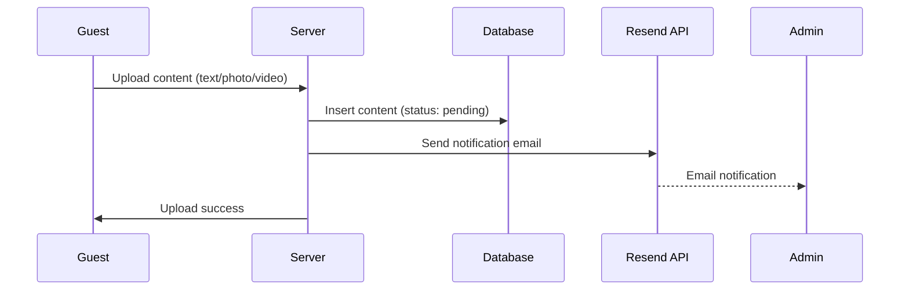

# Email Notifications Setup Guide

## Overview

This guide explains how to set up email notifications for the Guestbook admin. When guests upload new content (text, photos, or videos), the admin (Pierluigi) receives automatic email notifications.

## Features

- Automatic email notifications when new content is uploaded
- Non-blocking implementation (upload succeeds even if email fails)
- Includes user information, content type, and preview
- Direct link to admin dashboard for approval
- Uses Resend (free tier: 100 emails/day, no credit card required)

## Setup Instructions

### Step 1: Install Resend Package

Already completed during implementation:
```bash
npm install resend
```

### Step 2: Get Resend API Key

1. Visit [https://resend.com/signup](https://resend.com/signup)
2. Sign up with your email (free tier, no credit card required)
3. Verify your email address
4. Go to **Settings → API Keys**
5. Click "Create API Key"
6. Copy the API key (starts with `re_`)

### Step 3: Configure Environment Variables

Add the following to your `.env.local` file:

```env
# Email notifications (Resend)
RESEND_API_KEY=re_your_actual_api_key_here

# Admin email for notifications
ADMIN_EMAIL=your-admin-email@example.com
```

**Important:**
- Replace `re_your_actual_api_key_here` with your actual Resend API key
- Replace `your-admin-email@example.com` with the email where you want to receive notifications
- Never commit `.env.local` to Git (already in `.gitignore`)

### Step 4: Test Email Functionality (Local Development)

1. Start your development server:
```bash
npm run dev
```

2. Visit the test endpoint:
```
http://localhost:4000/api/test-email
```

3. Check your admin email inbox for the test notification

**Expected Result:**
- Status 200 with JSON response `{ "success": true }`
- Email received at your admin email address
- Email contains sample data (Mario Rossi, text message)

### Step 5: Configure Resend Domain (Optional but Recommended)

To prevent emails from going to spam:

1. Go to Resend Dashboard → **Domains**
2. Click "Add Domain"
3. Enter your domain (e.g., `giuliana40.vercel.app`)
4. Add the DNS records shown by Resend to your domain provider
5. Wait for verification (usually 5-10 minutes)
6. Update the `from` field in `/Users/pierluigibaiano/Development/g_gift/src/lib/email.ts`:
   ```typescript
   from: 'Guestbook Giuliana <noreply@yourdomain.com>'
   ```

**If you don't have a custom domain:**
- Use the default sender: `onboarding@resend.dev`
- Emails may go to spam, but will still be delivered

### Step 6: Deploy to Production

When deploying to Vercel:

1. Go to your Vercel project dashboard
2. Navigate to **Settings → Environment Variables**
3. Add the following variables:
   - `RESEND_API_KEY`: Your Resend API key
   - `ADMIN_EMAIL`: Your admin email address
4. Redeploy your application

## Email Notification Flow



## Email Template

The notification email includes:

- **Subject**: `[Emoji] Nuovo [tipo] da approvare - [Nome Utente]`
- **Content**:
  - User name and email
  - Content type (TESTO/FOTO/VIDEO)
  - Preview (for text content, first 100 characters)
  - Upload timestamp
  - Direct link to admin dashboard

Example:
```
🎉 Nuovo contenuto da approvare

Utente: Mario Rossi (mario@example.com)
Tipo: TESTO
Anteprima: Buon compleanno Giuliana! Ti auguro...
Data: 23/01/2026, 14:30

[Vai alla Dashboard Admin]
```

## Files Modified

1. **Package Dependencies**
   - Added `resend` package

2. **Environment Variables**
   - `/Users/pierluigibaiano/Development/g_gift/.env.example` - Added Resend configuration template

3. **Email Service**
   - `/Users/pierluigibaiano/Development/g_gift/src/lib/email.ts` - Email sending logic

4. **Database Queries**
   - `/Users/pierluigibaiano/Development/g_gift/src/lib/supabase/queries.ts` - Added `selectFullProfileById` helper

5. **Server Actions**
   - `/Users/pierluigibaiano/Development/g_gift/src/actions/content.ts` - Integrated email notifications in all upload functions

6. **Test API**
   - `/Users/pierluigibaiano/Development/g_gift/src/app/api/test-email/route.ts` - Test endpoint for email verification

## Error Handling

The email notification system is **non-blocking**:
- If email sending fails, the upload still succeeds
- Errors are logged to the console for debugging
- No user-facing error messages for email failures
- This ensures the guest experience is not affected by email service issues

## Troubleshooting

### Emails Not Received

1. **Check spam folder** - Emails from `onboarding@resend.dev` may be filtered
2. **Verify API key** - Ensure `RESEND_API_KEY` is set correctly in `.env.local`
3. **Check admin email** - Ensure `ADMIN_EMAIL` is set correctly
4. **Check console logs** - Look for email sending errors in server logs
5. **Test endpoint** - Visit `/api/test-email` to verify Resend is working

### API Key Errors

If you see errors like "Invalid API key":
- Verify your API key is correct (copy-paste from Resend dashboard)
- Ensure there are no extra spaces or quotes in `.env.local`
- Restart your development server after changing environment variables

### Rate Limiting

Resend free tier limits:
- 100 emails per day
- 3,000 emails per month

For this project with 20-50 guests and rate limiting of 1 upload per minute, this is more than sufficient.

## Testing Checklist

- [ ] Resend API key obtained
- [ ] Environment variables configured in `.env.local`
- [ ] Test endpoint returns success
- [ ] Test email received at admin email
- [ ] Upload text content triggers email
- [ ] Upload photo triggers email
- [ ] Upload video triggers email
- [ ] Email contains correct user information
- [ ] Email link to admin dashboard works
- [ ] Production environment variables configured in Vercel

## Security Notes

- Never commit API keys to Git
- `.env.local` is in `.gitignore` for safety
- Use environment variables for all sensitive data
- Remove or secure the test endpoint (`/api/test-email`) before production

## Future Improvements

Potential enhancements (not in MVP):
- Email throttling (max 1 email per 5 minutes to avoid spam)
- Batch notifications (send digest every hour instead of per upload)
- Rich HTML templates with inline images
- Email preferences for admin (enable/disable notifications)
- SMS notifications via Twilio for urgent approvals

## Support

For issues with:
- **Resend API**: Visit [Resend Documentation](https://resend.com/docs)
- **Environment Variables**: See [Next.js Env Docs](https://nextjs.org/docs/basic-features/environment-variables)
- **Email Service Code**: Check `/Users/pierluigibaiano/Development/g_gift/src/lib/email.ts`
